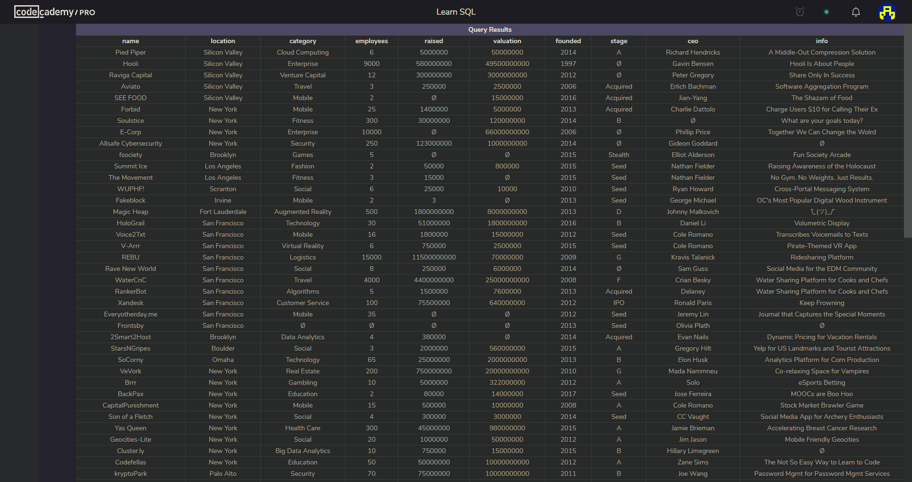
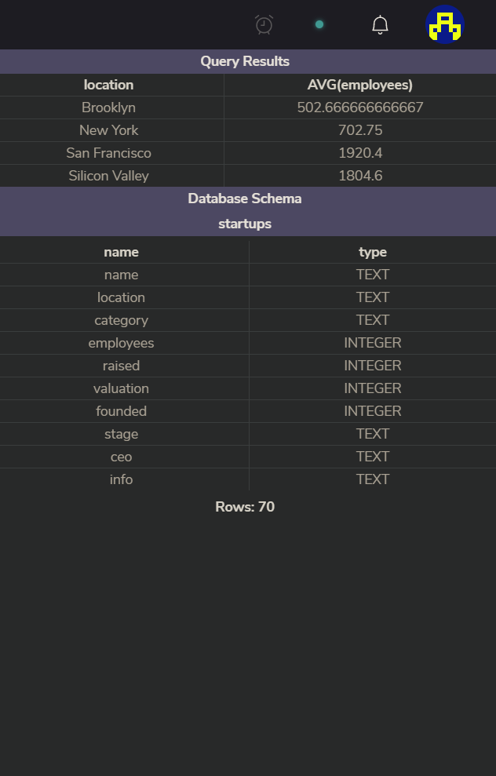

Trends in startups project

In this Pro project I was practicing aggregate functions in SQL.  

First, I had to find out what the entire table contains.

My tasks included finding info about: 
  - total value of all companies in this table,   
  - the highest amount raised by a startup?,    
  - maximum amount of money raised, during ‘Seed’ stage.    

What were the most competitive markets?    
 - I have retured the name of each category with the total number of companies that belong to it and then filter the result to only include categories that have more than three       companies in them.
 
 They asked me about difference in startups sizes among different locations:
  - What is the average size of a startup in each location? / with average sizes above 500?
  
  
  
  
  
  
